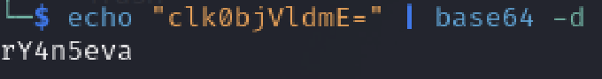
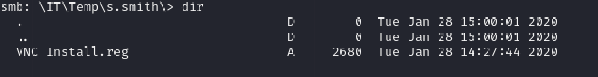
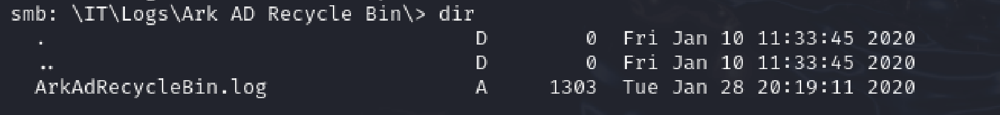

This is a medium box, but it felt hard to me. It was relatively fun to pwn.

## nmap

Starting off with an `nmap` scan, all the ports open are typical ports for a domain controller.

## Initial Recon

Anonymous `ldap` bind is successful.

Under user `r.thompson`, there is a field that looks like a `base64` encoded password string. Decoding it gives a cleartext password.

However, running `netexec` shows that user `r.thompson` is not a member of the `Remote Management Users` group.

## Lateral Movement

### First Lateral Movement

Running `netexec` to enumerate `smb` shows that the user `r.thompson` can read the non-default share `Data`.

Using `smbclinet` to log on, there are 3 files that catch my attention.

The content of `VNC Install.reg` reveals a password field. 

Looking up for "VNC password decrypt", I found this Github repo that says how to decrypt the password on Linux: https://github.com/frizb/PasswordDecrypts

I obtained the cleartext password for user `s.smith` and determined that the user is a member of the `Remote Management Users` group.

### Second Lateral Movement

Running `netexec` reveals that the user `s.smith` can read the non-default drive `Audit$`.

In the drive, I downloaded 2 files. One is a `.NET` executable and the other one is a `sqlite` database file.

After opening the database file with `sqlite3 Audit.db`, I executed the following commands to extract a `base64` encoded password string for user `arksvc`. However, decoding it reveals unreadable characters, which is an indication that the string is encrypted.

Next, I used `AvaloniaILSpy` to decompile `CascAudit.exe` and found that the executable is used to decrypt passwords. Since it uses a function `Crypto.DecryptString`, I went back and downloaded `CascCrypto.dll` from `smb`.

Decompiling it reveals that it's performing `AES` encryption. 

Obtaining the mode, IV, and secret key, an online decryptor gives the cleartext password for the user `arksvc`.

## Privilege Escalation

In the file I obtained earlier via `smb` about meeting notes, it reveals that we will need to find the password of `TempAdmin` since it will be the same as the Administrator's password.

In the log file I obtained earlier via `smb`, it shows that the user `TempAdmin` has been deleted by `arksvc`.

I logged in as `arksvc` via `evil-winrm`.

Enumerating deleted users using the `powershell` command reveals a `base64` encoded password string that can be directly decoded. 

`netexec` shows that the Administrator's password is indeed the same as `TempAdmin`.

