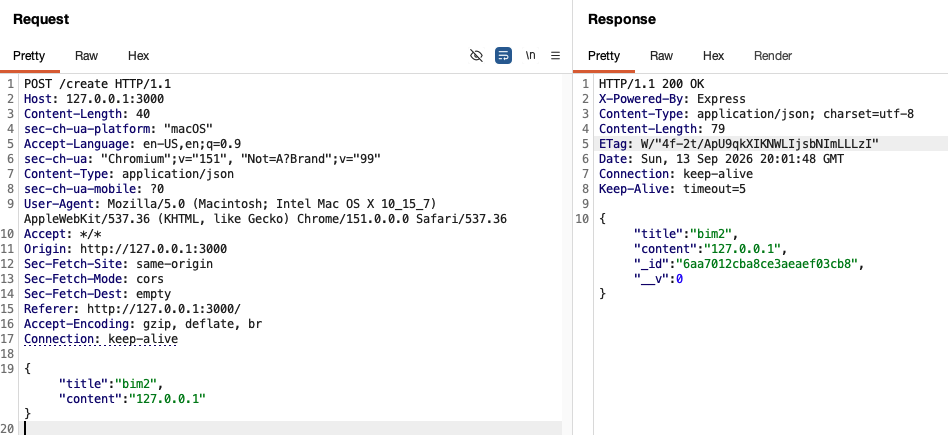
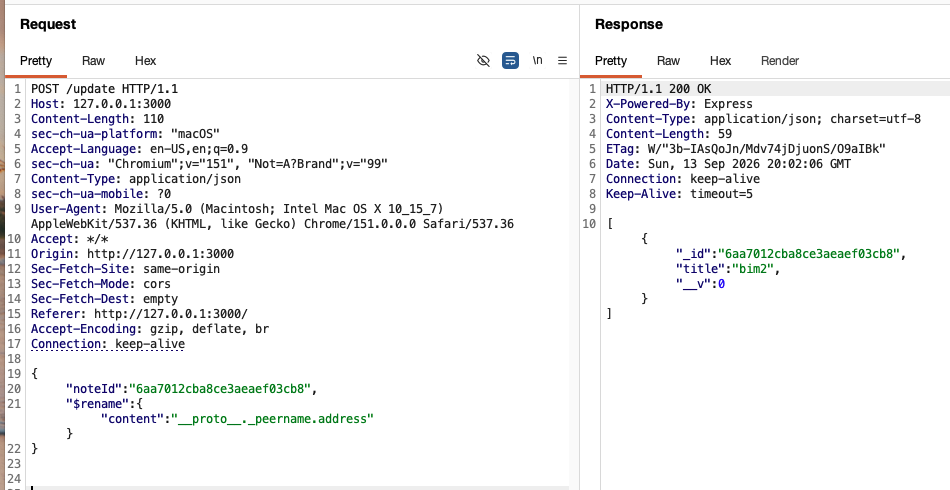
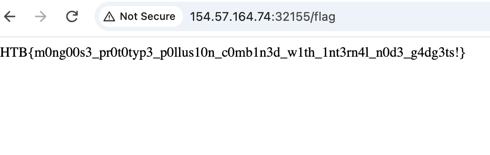

This was a pretty fun challenge. I've always known about prototype pollution, but this challenge taught me beyond the high level knowledge to actually find the gadget to exploit it.

## Initial Inspection

This simple Express.js app allows creating, deleting, and updating notes. When first examining the source code, I noticed that it's using [Mongoose](https://mongoosejs.com/), a MongoDB object modeling tool. Instinctively, I checked the `package.json` and found that the mongoose version is 7.2.4. So I searched up for known vulnerabilities and identified [CVE-2023-3696](https://nvd.nist.gov/vuln/detail/cve-2023-3696). Now, what's our goal? There is a straight-forward endpoint `/flag` that checks if request "comes from the internal server" by validating `req.connection.remoteAddress`:

```js
app.get('/flag', (req, res) => {

const remoteAddress = req.connection.remoteAddress;

if (remoteAddress === '127.0.0.1' || remoteAddress === '::1' || remoteAddress === '::ffff:127.0.0.1') {

res.send(process.env.FLAG ?? 'HTB{f4k3_fl4g_f0r_t3st1ng}');

} else {

res.status(403).json({ Message: 'Access denied' });

}

});
```

## CVE-2023-3696

This CVE is a prototype pollution vulnerability in `document.js`, via update functions such as `findByIdAndUpdate()`. `findByIdAndUpdate()` finds a document by id and update its fields. However, the vulnerability arises because during document initialization, the function iterates over keys from an input object and assigns corresponding values without any input filtering. So if the key is a constructor or `__proto__`, the assignment will propagate into `Object.prototype`.

## Finding the Gadget

However, prototype pollution by itself is not exploitable. In this case, we need to find a gadget to achieve what we want. Since the check happens in `req.connection.remoteAddress`, what if there's a way to pollute it so that we can arbitrarily "force set" our remoteAddress to 127.0.0.1? So I turned to look at how the code works underneath.
`req.connection.remoteAddress` originates from the underlying Node.js `http.incomingMessage` class. In `lib/net.js`, we can find the getter for remoteAddress:

[Code Reference](https://github.com/nodejs/node/blob/6193e15483395080c6438399211aa7fab70f4e5e/lib/net.js#L1250)
```js
protoGetter('remoteAddress', function remoteAddress() {
  return this._getpeername().address;
});
```

This references the address field from function `_getpeername()`. In the same file we can find the function:

[Code Reference](https://github.com/nodejs/node/blob/6193e15483395080c6438399211aa7fab70f4e5e/lib/net.js#L1225)
```js
Socket.prototype._getpeername = function() {
  if (!this._handle || !this._handle.getpeername || this.connecting) {
    return this._peername || {};
  } else if (!this._peername) {
    const out = {};
    const err = this._handle.getpeername(out);
    if (err) return out;
    this._peername = out;
  }
  return this._peername;
};
```

It returns `this._peername` if it exists so the function remoteAddress is essentially checking for the value of address of the object `this._peername`!

## Full Chain

So when we use prototype pollution to set the property `Object.prototype._peername.address = "127.0.0.1"`, here is what happens the application receives a request to `/flag`:
1. The application attempts to check the client's IP address by invoking `req.connection.remoteAddress`.
2. The execution enters Node.js's built-in `lib/net.js` file where the public getter for `remoteAddress` is defined.
3. The getter is programmed to call the internal performance optimization function `_getpeername()` to look for a cached value.
4. Execution jumps into the `Socket.prototype._getpeername` function.
5. The current socket instance does _not_ have an explicit `_peername` property of its own. JavaScript follows standard inheritance rules and climbs up the prototype chain to `Object.prototype._peername` and returns the polluted object.
6. The getter looks up for address in the polluted `_peername` and returns "127.0.0.1".

## Exploit
Now, let's perform the actual exploit!
Firstly, create a new note with content set to "127.0.0.1":




Then, use the `$rename` operator to perform the prototype pollution by using the key `__proto__` and value `_peername.address`. This will perform a deep assignment that reads the value at the old path "content" of our note and write that value to our new path, which is why we need the same noteId containing our string:



Now, simply navigate to `/flag` and obtain the flag!

