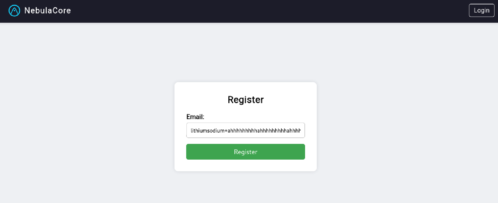
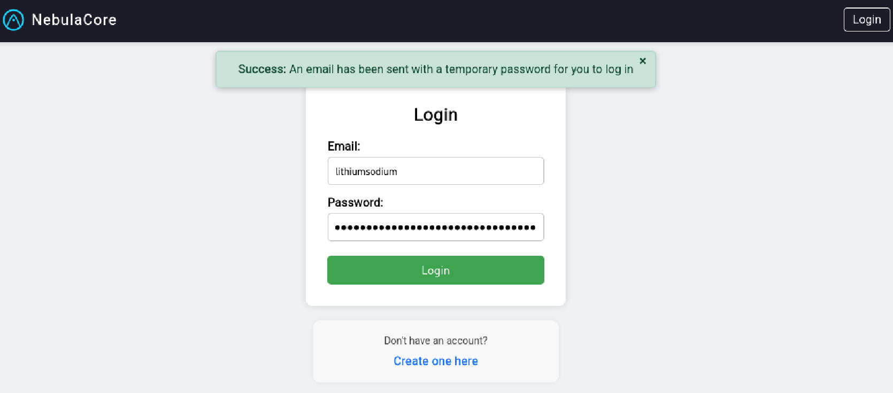
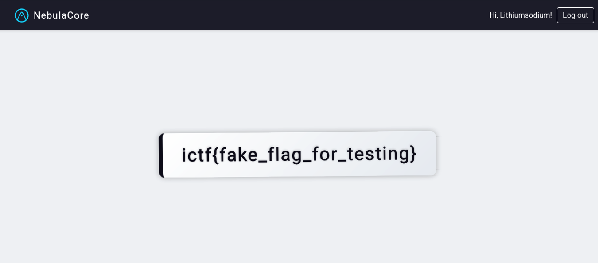

## Overview

The initial set up of this challenge is that there is "no way" to obtain the initial password because the emailing feature has not been implemented. However, there is a flaw in the way the initial password is generated and hashed, resulting in an authentication bypass.

## Approach

Source was given, and the first thing I looked into was how the initial password was generated in `index.js`. This is the code that is run when registering withg an email:

```javascript
app.post('/user', limiter, (req, res, next) => {
    if (!req.body) return res.redirect('/login')

    const nEmail = normalizeEmail(req.body.email)

    if (nEmail.length > 64) {
        req.session.error = 'Your email address is too long'
        return res.redirect('/login')
    }

    const initialPassword = req.body.email + crypto.randomBytes(16).toString('hex')
    bcrypt.hash(initialPassword, 10, function (err, hash) {
        if (err) return next(err)

        const query = "INSERT INTO users VALUES (?, ?)"
        db.run(query, [nEmail, hash], (err) => {
            if (err) {
                if (err.code === 'SQLITE_CONSTRAINT') {
                    req.session.error = 'This email address is already registered'
                    return res.redirect('/login')
                }
                return next(err)
            }

            // TODO: Send email with initial password

            req.session.message = 'An email has been sent with a temporary password for you to log in'
            res.redirect('/login')
        })
    })
})
```

The first thing I noticed was that even though it normalizes the email field it still uses the email provided by the user directly from `req.body.email`. However, this shouldn't be guessable since it contains randomly generated strings with `crypto.randomBytes(16)`. The problem is that it uses `bcrypt` to hash the password. Credit to a mysterious friend, I found out that `bcrypt` truncates the input if it's more than 72 bytes long. It's noted in the documentation in "Security Issues And Concerns" as well:

"Per bcrypt implementation, only the first 72 bytes of a string are used. Any extra bytes are ignored when matching passwords. Note that this is not the first 72 _characters_. It is possible for a string to contain less than 72 characters, while taking up more than 72 bytes (e.g. a UTF-8 encoded string containing emojis)."
[https://www.npmjs.com/package/bcrypt](https://www.npmjs.com/package/bcrypt)

Then an idea came to my mind: what happens if I make the email field more than 72 bytes long, then will the password just bee truncated to the first 72 bytes which is user-controllable? However, it seems like there is a check that restricts it to 64 characters:

```javascript
if (nEmail.length > 64) {
    req.session.error = 'Your email address is too long'
    return res.redirect('/login')
}
```

Looks like it uses a module `normalizeEmail` to normalize the email value. So I went looking into the documentation again, and this is in the usage section:

```
var normalizeEmail = require('normalize-email')

normalizeEmail('johnotander@GMAIL.com')         // => 'johnotander@gmail.com'
normalizeEmail('john.o.t.a.n.d.e.r@gmail.com')  // => 'johnotander@gmail.com'
normalizeEmail('johnotander@googlemail.com')    // => 'johnotander@gmail.com'
normalizeEmail('johnotander+foobar@gmail.com')  // => 'johnotander@gmail.com'
normalizeEmail('JOHN.OTANDER+OHAI@gmail.com')   // => 'johnotander@gmail.com'
```

This is the perfect solution for the bypass! It simply already exists there for us to abuse.

## Solution

Now, we can chain together the thoughts to bypass authentication.

First, I registered with an email field longer than 72 bytes using the plus symbol example from `normalizeEmail`. This is the email I used: `lithiumsodium+ahhhhhhhhhahhhhhhhhhahhhhhhhhhahhhhhhhhhahhhhhhhhhahhhhhhhhhahhhhhhhhh@gmail.com`




Then, the username will be normalized to `lithiumsodium@gmail.com`, and I could log in with the original email I used to register as the password since `bcrypt` will just truncate it to the first 72 bytes for me.






