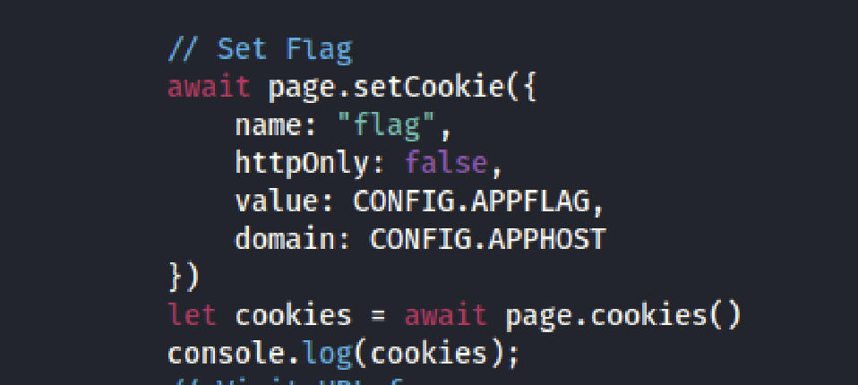
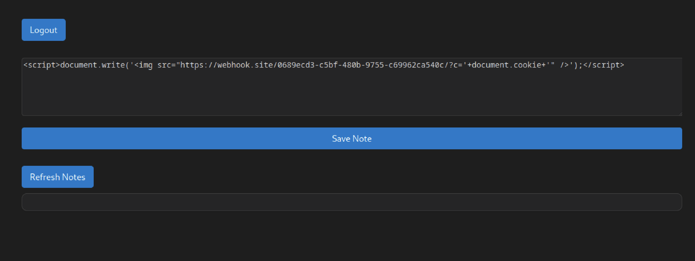
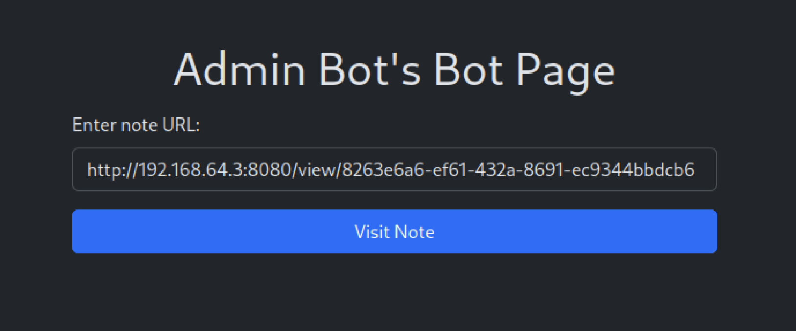
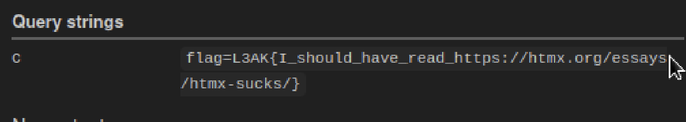

## Overview

This was an easy web challenge that involved a XSS(Cross-site scripting) attack. The set up was a web application that allowed users to register an account to log in and post notes. Additionally, there was an admin bot page in which the admin bot would visit the page url we gave it. Looking through the source code, I found that the flag was set as the cookie of the admin bot. So the goal was to craft a XSS attack to steal its cookie.

## Approach

In order to craft the XSS attack, I used `webhook` to generate a web server that allowed me to monitor the logs to this remote web server. I then made a post with a payload that would log the visiting browser's cookie: ``. What this payload does is that the browser will try to get the image from the image source to display on the page, which will actually direct it to the malicious web server that will get its cookie and store the cookie into a parameter named "c".

The final step was to give the admin bot the url to the post with my malicious payload so that it would execute the script.

## Solution

When I went back to webhook, I was able to see the request from the admin bot and get the flag from the "c" parameter.

