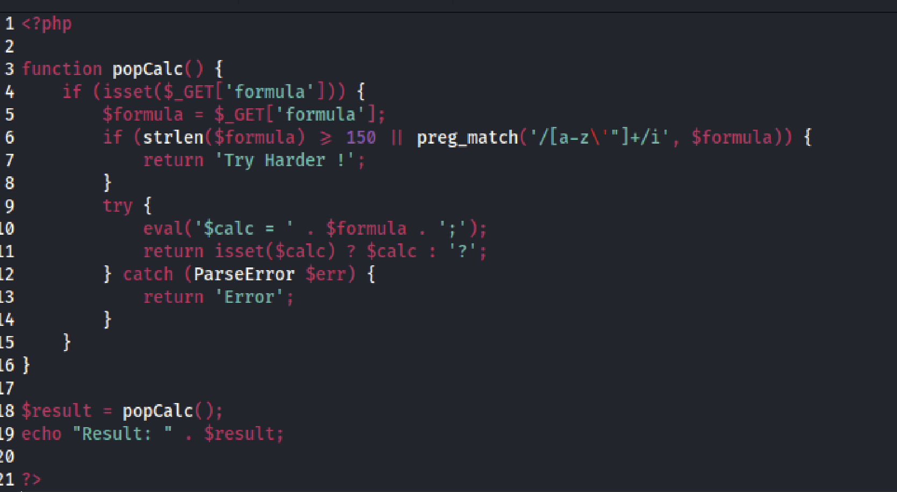
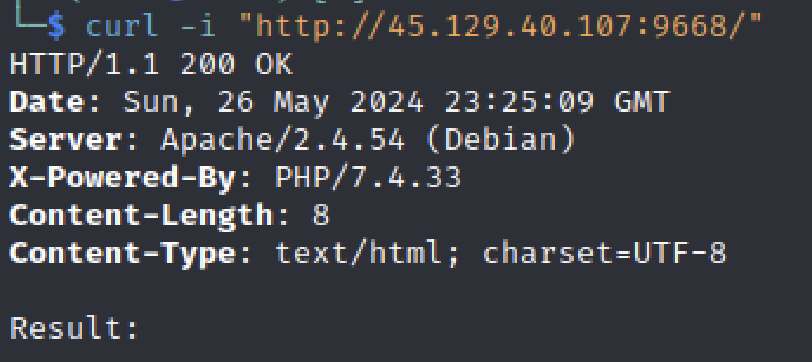
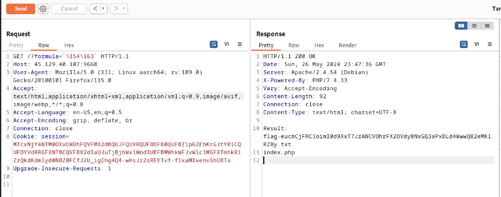
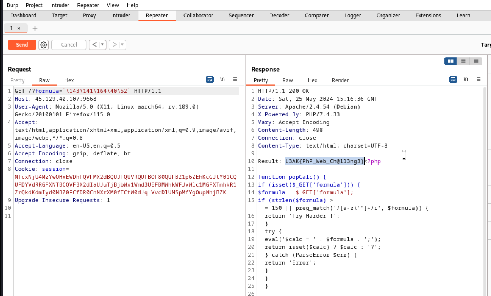

## Overview

The set up of this challenge was a simple calculator that allowed users to perform easy calculations, such as subtraction and multiplication, through the `formula` url parameter. It had a command injection vulnerability that allowed attackers to inject arbitrary commands on the host system to extract sensitive information.

## Approach

There was nothing much interesting in the frontend of the web page, so I turned to the source code and found the vulnerability immediately. The web application was using `eval()` to take in user input as a string and then executing it through `echo`. Whenever `eval()` is used in an application to take in an input it should always set off an alarm. There are numerous articles online explaining the danger of `eval()`. In this case, even though the author used a seemingly secure way, regular expression, to sanitize the user input before passing it into `eval()`, there were still ways to bypass the filter. Here is a screenshot of the source code:

### Bypassing Regex Filter

The author used PHP's `preg_match` function in attempt to sanitize the user input. Through an online regular expression tester, I found that the regex `[a-z\'"]` escapes all alphabetical characters, single quotes, and double quotes. That indicated I would need to first encode my payload. I checked the request headers and found that this application was using UTF-8 as teh default character encoding method.

After searching for different string encoding methods, I found that using octal for encoding strings in PHP only requires the use of numbers and backslashes. However, in order for the payload to resolve into system code it would have to be wrapped inside backticks. In PHP, backticks are the equivalent of `shell_execute()`. I first tested using the command `ls` to list all the files in the directory of the running web application. I encoded `ls` with octal using an online text to octal converter and used a backslash for escaping. Something worth mentioning is that I attempted sending the request with `curl`, but it did not work because apparently `curl` does some auto-decoding. Here is the screenshot of the response after I sent the request with my payload through Burpsuite:

It was great news that I was able to see all the files in the directory, which confirmed that my command injection technique worked. But it was not unintentional that there was a file named "flag" followed by a long, random list of characters. In addition to the regex filter, there was also a filter restricting the length of user input. To bypass that, I simply used the command `cat *` encoded to get the flag.

## Solution

Here is my payload and the response displaying the flag:

