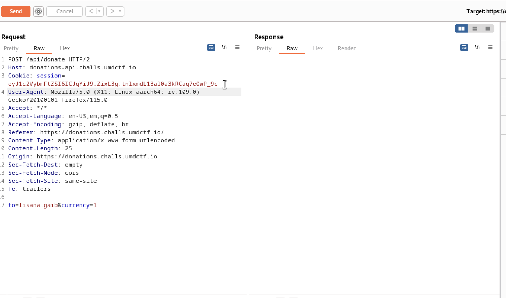
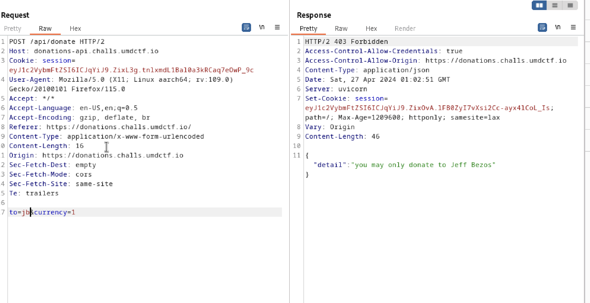
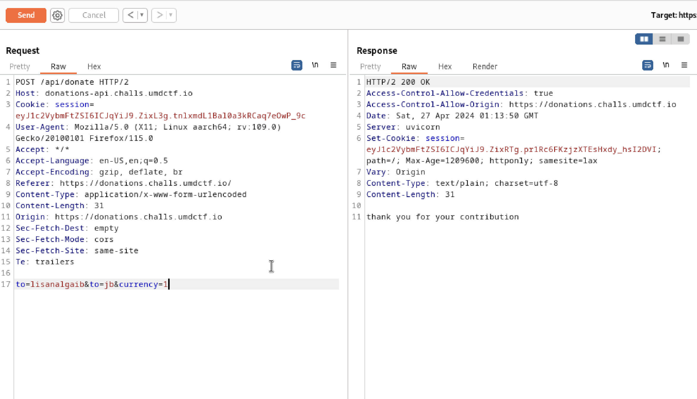
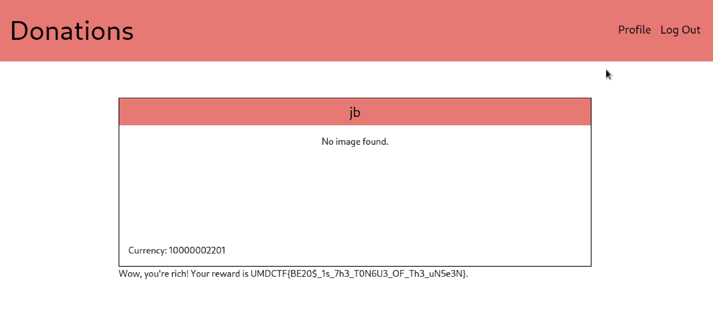

## Overview

This challenge has a parameter pollution vulnerability. In order to solve the challenge, I used `Burp Suite` to intercept the web request and started from there. 

## Approach

I first noticed that there is a login and a register page, so I made a new user and logged in as that user.

The message on the web page tells us that it wants us to get the most donations, but it seems like only Jeff Bezos is the only one you can donate to.

So I tried intercepting the donation request with `Burp Suite`.

I noticed that the request is sending my donation to "lisanalgaib", so I tried changing that to a user I created, but it did not work.

After some careful examination, I've decided to play around with the "to" paramter through overriding the destination with an additional "to" directed to my user. I checked that user's profile and see that my currency actually increased.

## Solution

However, I can send at most 1000 currency from each user. Therefore, I registered a bunch of users to send "currency" all to one account. Eventually, it reached the threshold (5000+ currency) to give me the flag.

