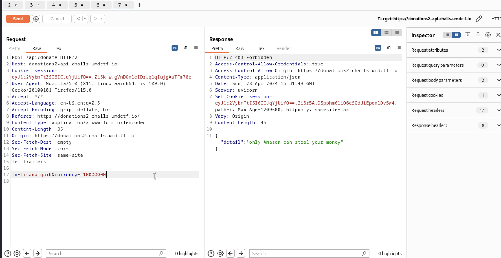
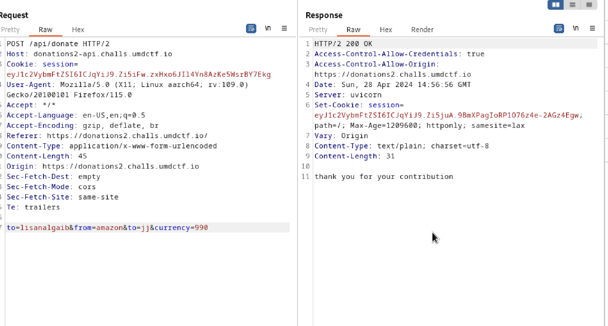
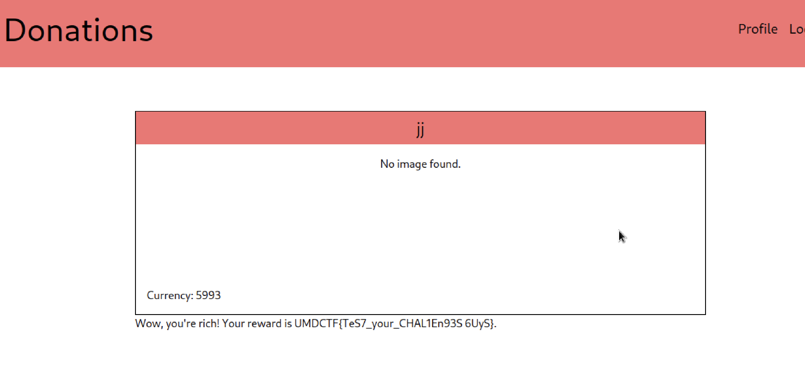

## Overview

The second part of "Donations" also has a parameter pollution vulnerability, so the approach is to exploit this vulnerability in the request.

## Approach

The first step was the same as part 1 of the challenge, where I registered a user and intercepted the request of making donations to "Jeff Bezos". I tried sending a negative amount, which the response returned an error message.

This was the key to finding the solution - the message told me that "only Amazon can steal your money". So I had the idea of adding a "from" paramter to indicate the sender as "amazon". Like part 1 of the challenge, I overrode the destination with an additional "to" directed to a user I created. As the image below shows, I was able to send "currency" from one user to another.

## Solution

The last step was the same as part 1. I registered a few users to send "currency" all to one account. Eventually, it reached the threshold (5000+ currency) to give me the flag.

