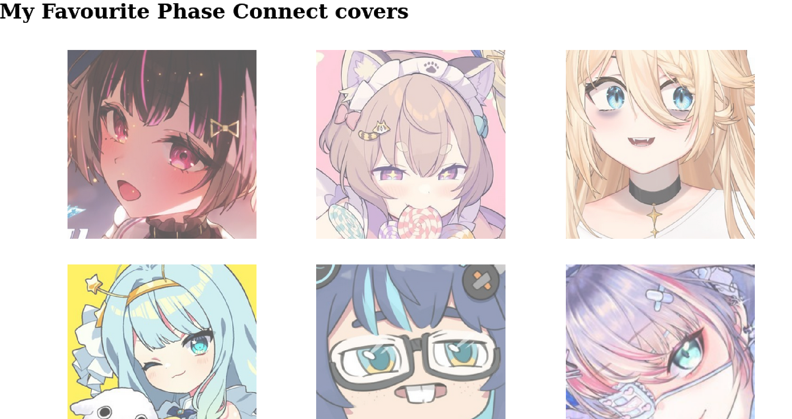
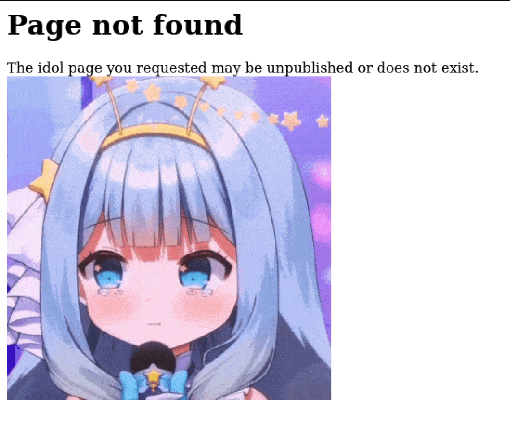
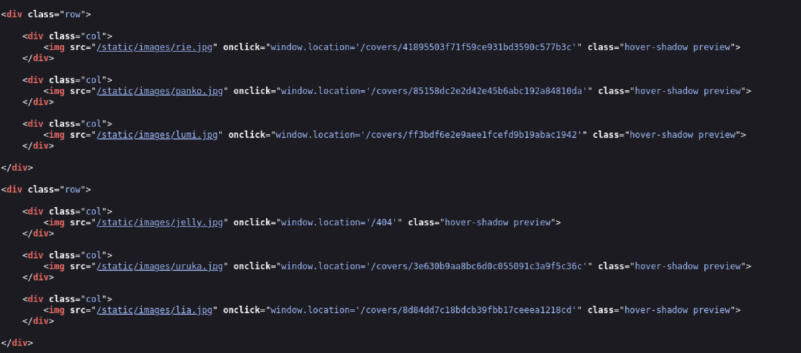
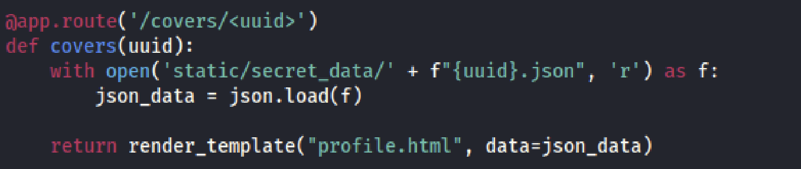
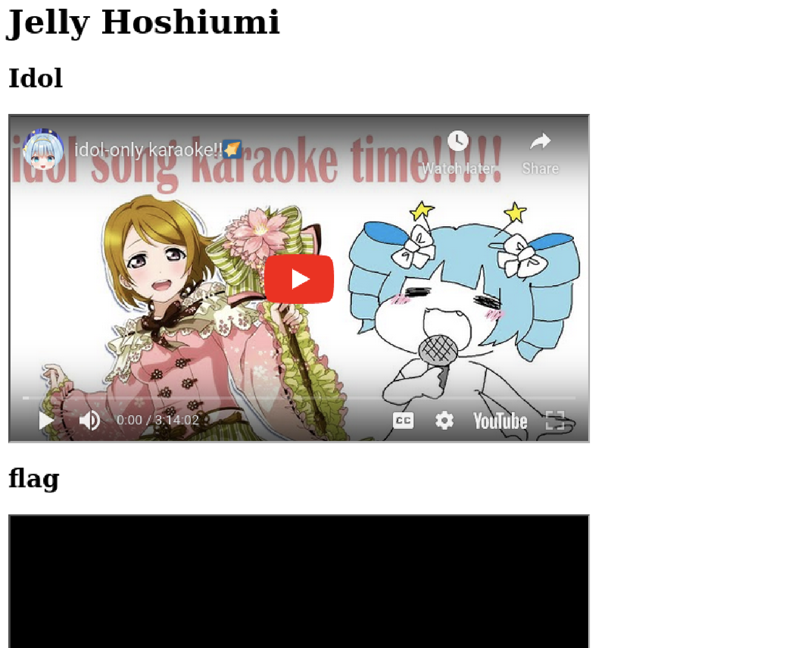
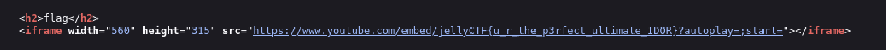

Description of challenge:
There's a hidden flag on Jelly's page, but the creator hasn't made her page public yet. Can you find a way to access her page and capture the flag?

## Overview

From the initial inspection, it seemed that the access to one of the Virtual Youtubers' page was restricted when clicking on her picture. However, there existed a broken access control vulnerability that allowed direct access to the web page by simply changing the url to an endpoint.

## Approach

When I first opened up the web page, I was greeted with 6 Virtual Youtubers' pictures. I was able to access all but the Virtual Youtuber Jelly's page through clicking on their pictures. I got a 404 response when I clicked on her picture. Based on the description and that the entire ctf was themed around the Virtual Youtuber, Jelly, the goal of this challenge was finding a way to access her page.

I then used Firefox's developer tools to view the page source to see the endpoints of the web pages. I found that the accessible endpoints all followed the format `/covers/{some_string}`. I immediately had a theory that the goal was to figure out the string leading to Jelly's page. 

I examined the source code which further confirmed my theory. In the source code, there was an endpoint `/covers/<uuid>` that allowed direct access. From experience, I realized that it didn't look like a uuid but rather a hash.

To confirm that the random string was indeed a hash, I took the string of one of the Virtual Youtubers, rie, and used an online hash decoder `https://hashes.com/en/decrypt/hash` to decode the hash. I got rie as the decrypted value back and the algorithm MD5: `41895503f71f59ce931bd3590c577b3c:rie`.

To get to Jelly's page, I generated a MD5 hash of "jelly". I used lowercase "j" as all other page endpoints all used lowercase names of the Virtual Youtubers. I used `https://www.md5hashgenerator.com/` and got the hash `328356824c8487cf314aa350d11ae145`.

## Solution

I changed the hash value of `rie` to `328356824c8487cf314aa350d11ae145`and got access to Jelly's page. My final url endpoint was: `https://aidoru.jellyc.tf/covers/328356824c8487cf314aa350d11ae145`. The flag was embedded in the source url of the second video on the page.

