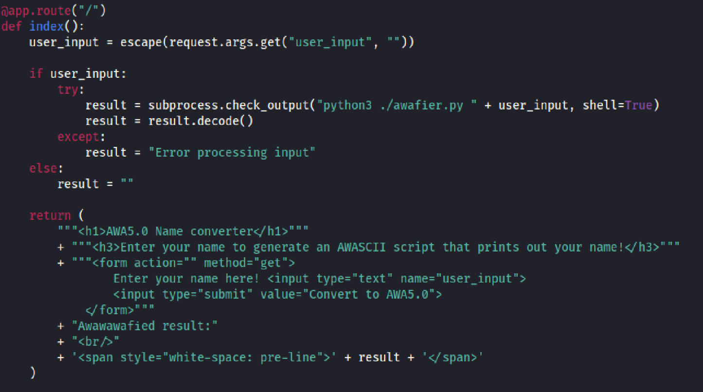
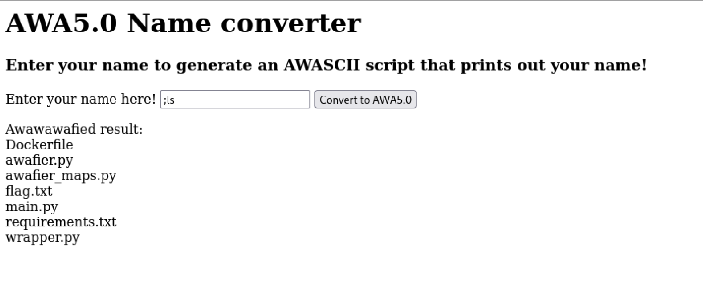
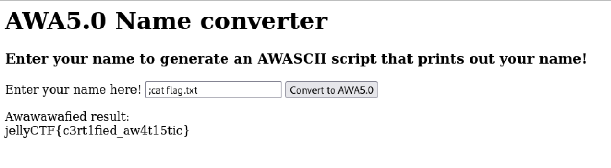

## Overview

The setting of this web page was a custom name converter that converted a user input into "AWASCII". Due to improper user input sanitization, a command injection vulnerability present in the application allowed execution of arbitrary command code.

## Approach

When I first opened up the web page, I noticed that there was a place for user input. I examined the source code `main.py` and found that the flask application was using python's subprocess module to start the python script `awafier.py` that took the user input as an argument. After checking the documentation of the python module, it appeared that the library will not implicitly choose to call a system shell unless it's invoked via `shell=True`. In this challenge, this was invoked explicitly as shown in the screenshot of the source code.

I saw that there was no further sanitization implemented, so I tested the vulnerability with `;ls` to list the files in the running application's directory. I used a semicolon to insert a second command for execution.

## Solution
After confirming that the application allowed command injection, I obtained the flag by putting `;cat flag.txt` as an input to display the contents of the file `flag.txt`.

