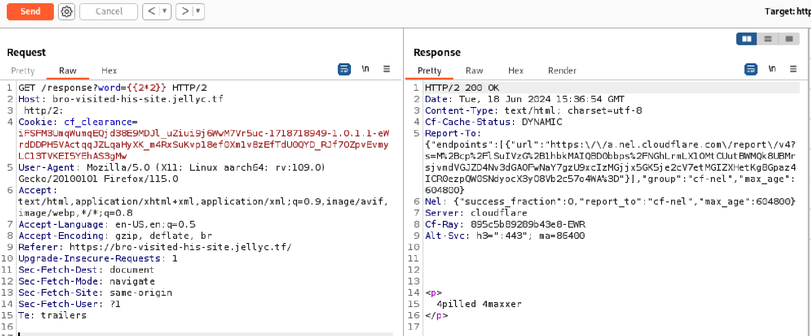
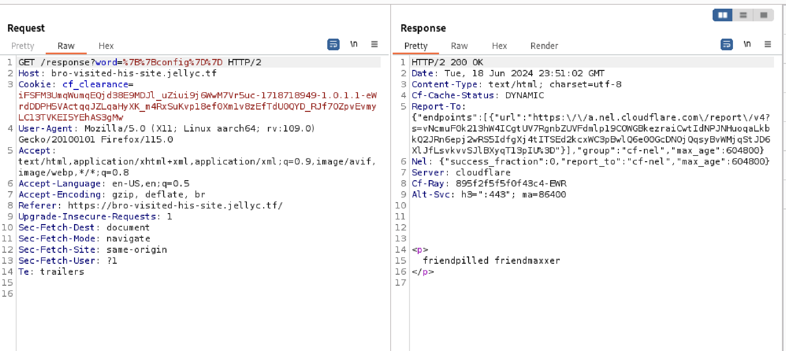
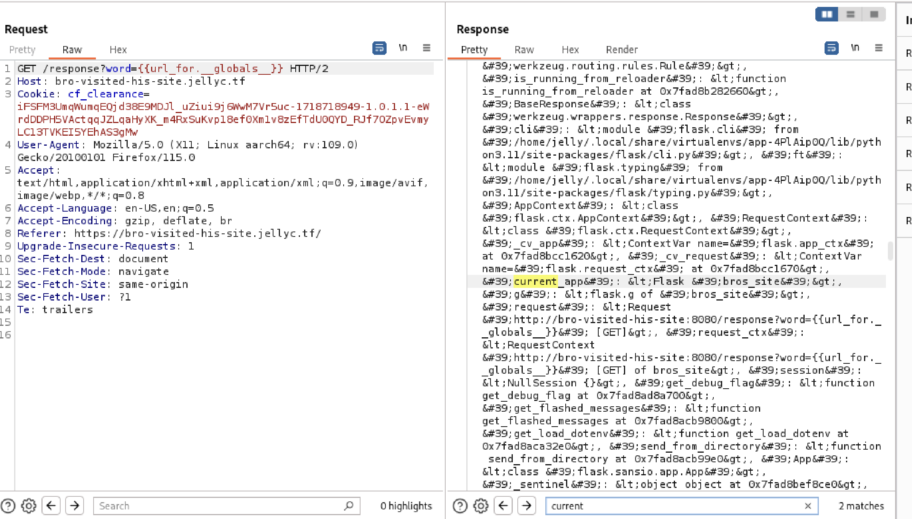
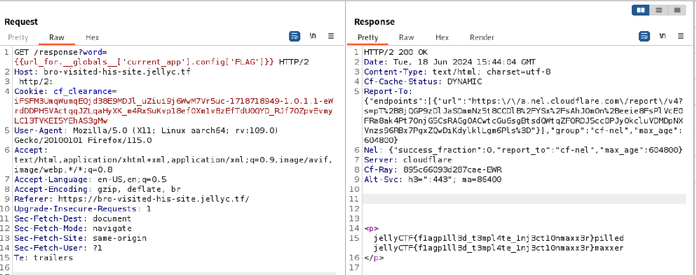

## Overview

This was a good beginner challenge that involved a Server-Side Template Injection vulnerability in the Flask application's Jinja2 template engine. This vulnerability allowed access to read the contents of the applicatoin's config object, which was where the flag for this challenge was located.

## Approach

When I first opened up the web page, I was presented with a form input. I tested the level of input sanitization with a mathematical expression in double curly braces:  `{{2*2}}`, which prints the contents in between to the template output. To better see the response from the browser, I sent my request using `Burpsuite` and got a positive indication of a Server-Side Template Injection vulnerability.

Opening up the source code, I saw that the flag was set to a part of the config object, so the goal was to abuse this vulnerability to display the contents of the config object. Normally, using `config` or `self.__dict__` would achieve it. However, both the source code and the response showed that the application implemented a filter on the use of them by setting them to display "friend" and "visited" instead of the actual contents.

## Solution

Eventually, I found that I could access config from its upper global variable, such as `current_app`. I found `current_app` in the `url_for` function and got the flag.

