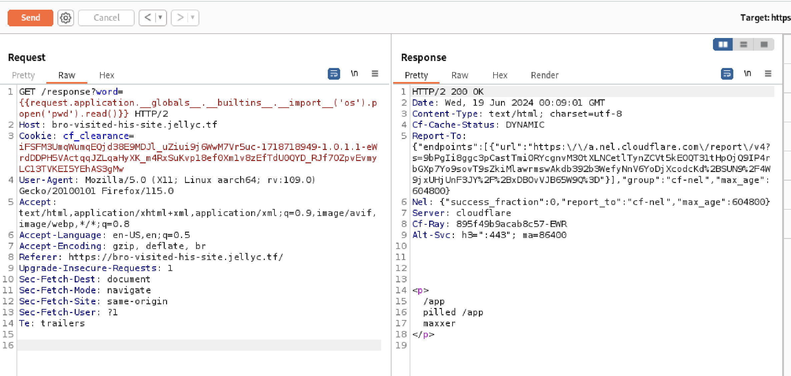
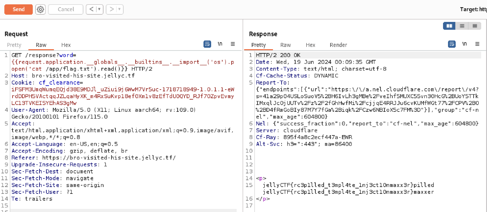

## Overview

This was the second part of the same application, which also involved the Server-Side Template Injection Vulnerability. However, this time the flag was in the file `flag.txt` in the application directory, which can be accessed through remote code execution using the request object.

## Approach

To achieve remote code execution, the goal was to import the `os` module, which can be found in request's `__builtins__` method via the `__globals__` attribute. 

## Solution

I first used `pwd` to print the current working directory of the application. I then read the contents of `flag.txt` with its absolute path.

